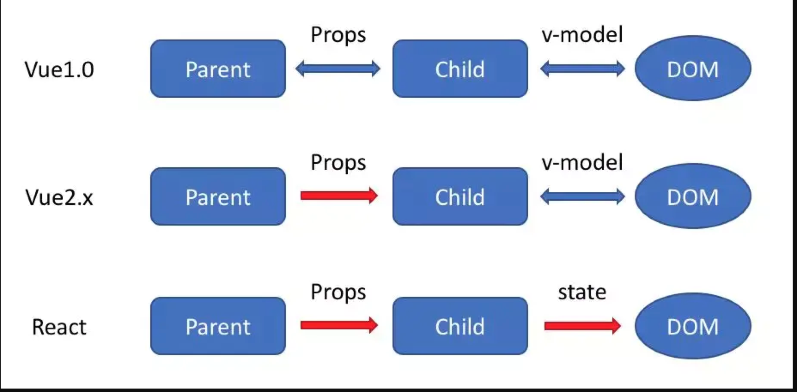

### vue 与 react 的区别
#### 监听数据变化的实现原理不同
- Vue 通过 getter/setter 以及一些函数的劫持，能精确知道数据变化，不需要特别的优化就能达到很好的性能
- React 默认是通过比较引用的方式进行的，如果不优化（PureComponent/shouldComponentUpdate）可能导致大量不必要的VDOM的重新渲染
#### 数据流的不同

#### HoC 和 mixins
- Vue 中我们组合不同功能的方式是通过 mixin
- React中我们通过 HoC (高阶组件）
#### 组件通信的区别

#### 模板渲染方式的不同
- React 是通过JSX渲染模板
- Vue是通过一种拓展的HTML语法进行渲染
#### Vuex 和 Redux 的区别
- 在 Vuex 中，$store 被直接注入到了组件实例中，因此可以比较灵活的使用：
  - 使用 dispatch 和 commit 提交更新
  - 通过 mapState 或者直接通过 this.$store 来读取数据
- 在 Redux 中，我们每一个组件都需要显示的用 connect 把需要的 props 和 dispatch 连接起来。